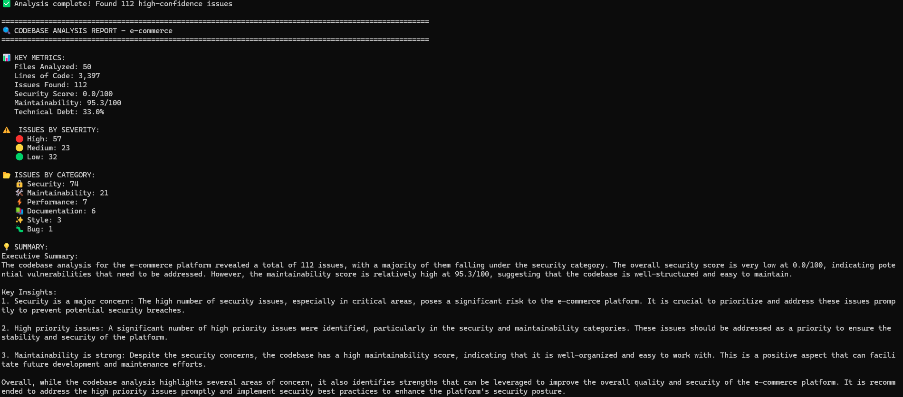
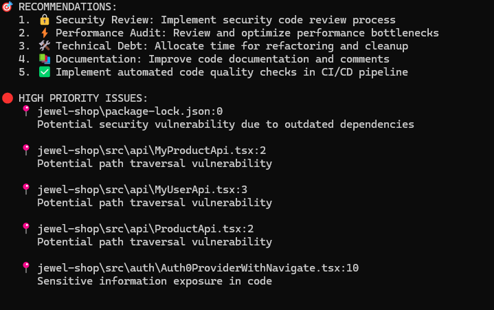
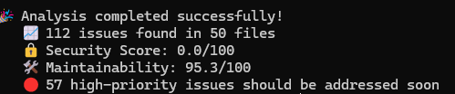
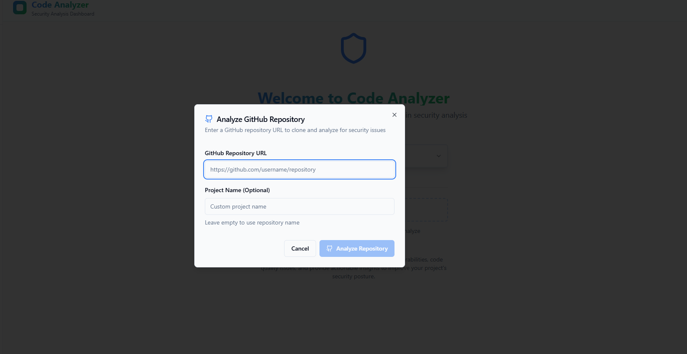
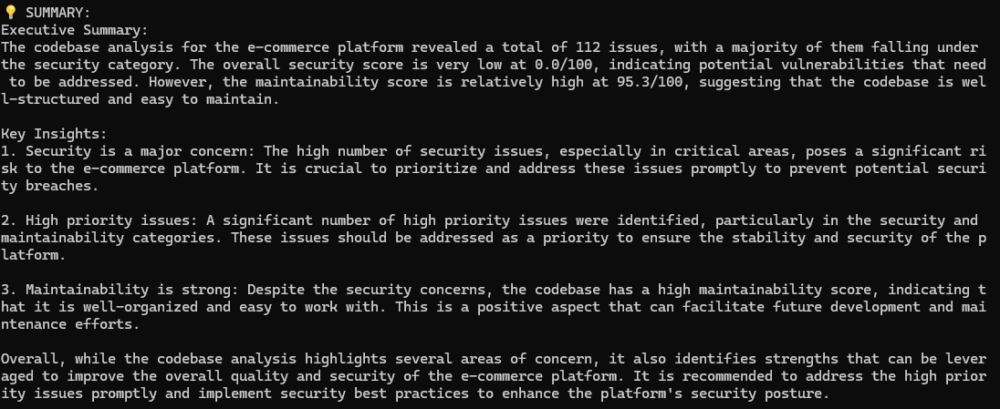
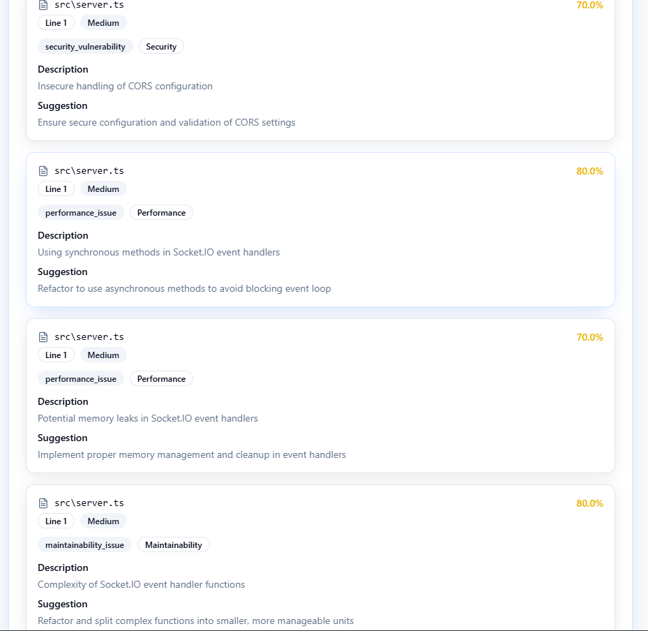
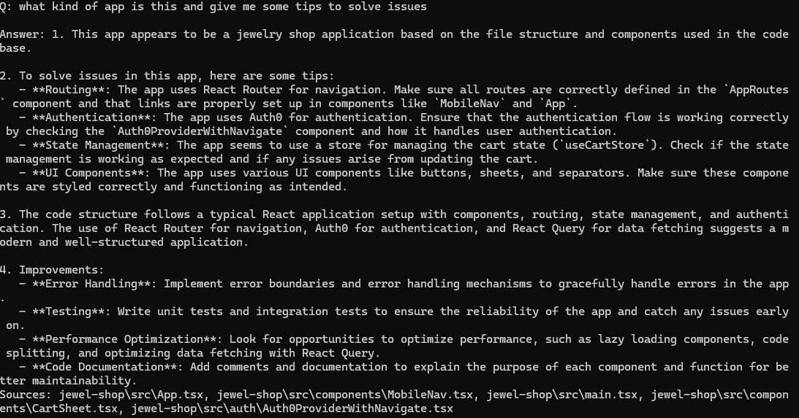
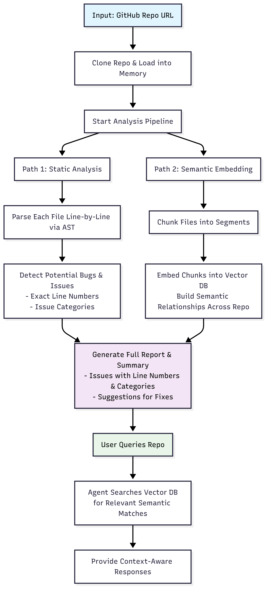

# CodeBase Analyzer Agent

A powerful tool to analyze code repositories, detect quality issues, generate detailed reports, and provide interactive Q&A for developers. Supports multiple programming languages, with a focus on modularity and developer-friendly insights.

## Features

- **Code Analysis**: Accepts local files, folders, or GitHub repo URLs; supports Python and JavaScript and react  ( extensible to other languages).
- **Quality Issue Detection**: Identifies security vulnerabilities, code duplication, and complexity issues using AST parsing.
- **Detailed Reports**: Generates comprehensive reports with issue details, line numbers, categories, and fix suggestions by LLM 
- **Interactive Q&A**: Allows natural-language queries about the codebase, powered by a vector database(Chroma DB) for semantic search.
- **Web Deployment (Bonus)**: Analyze GitHub repos react app.
- **RAG Integration (Super Stretch)**: Uses Retrieval-Augmented Generation for large codebases, embedding code chunks in a vector DB for efficient Q&A.
- **Visualizations (Super Stretch)**: It also shows dependency graphs and issue severity charts.

## Setup

### Prerequisites

- Python 3.8+
- Dependencies (listed in `requirements.txt`)

### Installation

1. Clone a sample repo in the root dir :

   ```bash
   git clone https://github.com/username/obfuscated-project-name.git
   ```

2. Set up a virtual environment:

   ```bash
   python -m venv venv
   source venv/bin/activate  # On Windows: venv\Scripts\activate
   ```

3. Install Python dependencies:

   ```bash
   pip install -r requirements.txt
   ```


## Usage

### CLI

Analyze a local codebase:

```bash
python ./analyzer.py {directory of the repo} 
```


Start interactive Q&A:

```bash
python ./analyzer.py {directory of the repo} --interactive
```






### Web UI

1. Start the web server:

   ```bash
   npm run dev
   ```

2. Open `http://localhost:5173` in your browser.

3. Enter a GitHub repo URL 



### Example json analysis for whole prject

**Report** (saved as `report.json `):

### # Code Quality Report\\

### Summary


### Issues
1. \*\*Security Vulnerability\*\* (High) - File: \`app.py\`, Line: 42\\

Issue: Hardcoded API key detected.\\

- Suggestion: Use environment variables.\

### Also shows lists of  issues in web

     ...

### **Interactive Q&A**:



### Architecture Diagram

